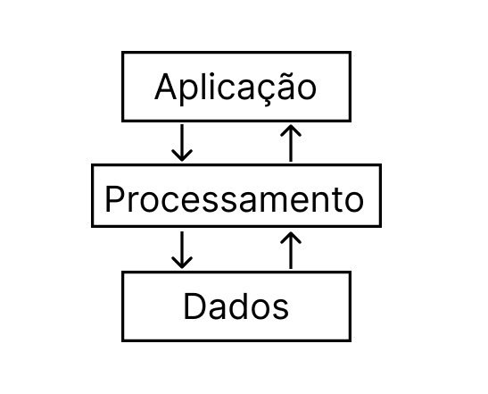
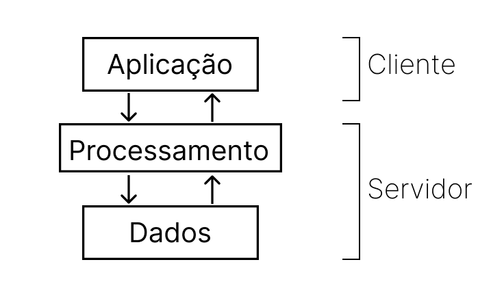

# SistemasDistribuidosLab2: Dicionario cliente/servidor
A aplicação desenvolvida passui alguns componentes divididos em 3 módulos principais: **aplicação**, **processamento** 
e **dados**. 

O módulo **aplicação** é responsável por conectar o cliente ao servidor, receber as entradas do cliente, 
enviá-las ao servidor e devolver o resultado do **processamento** ao cliente. Esse módulo é basicamente a 
**interface**, responsável por todo contato com o  usuário.

Em **processamento** ocorre a execução do programa. Ele recebe a entrada do módulo **aplicação** e retorna o que foi solicitado, 
além disso, o administrador (que está executando esse código) pode fazer 3 operações direto no terminal para modificar o 
dicionário, são elas: **delete** (apaga uma chave ou todo dicionário), **salva** (guarda o dicionário atual no json) e **fim** 
(finaliza a execução quando todos os clientes já ativos encerrarem). Nessa parte lemos e escrevemos no dicionário por 
meio de duas classes: **ler** (recebe a chave e retorna seu valor) e **escrever** (recebe a chave e o valor, junta a lista 
se a chave já existe ou cria a chave com o valor solicitado, seu retorno é apenas a confirmação da inserção).

O último módulo **dados** é responsável por salvar e recuperar o dicionário numa próxima execução. Ele faz isso pela 
classe **dic**, nela temos duas funções: **iniciaDicionario** (recupera o dicionário) e **salvaDicionario** (guarda o 
dicionário ao fim da execução ou quando solicitado pelo administrador). Essa persistência é feita pelo **json** aqui adicionado.

A **arquitetura de software** escolhida foi **em camadas**, uma vez que a **aplicação** só precisa se comunicar com o 
**processamento** e a camada de **dados** apenas provê o dicionário de entrada e guarda o da saída, sendo assim, só se comunica com **processamento**.

A **arquitera de sistema** utilizada foi **centralizada**. O uso do **cliente/servidor** permite a separação dos módulos 
anteriores em 2 tipos. O **cliente** ficará com a camada de **aplicação** interagindo com o usuário, fornecendo entradas 
ao servidor e mostrando ao usuário as saídas desejadas. O **servidor** será responsável pelo **processamento** e **dados**, 
portanto recebe as entradas do módulo aplicação, e, de acordo com a entrada, fornece o resultado da leitura ou escrita, 
além disso, recupera o dicionário da execução anterior e salva o último.

